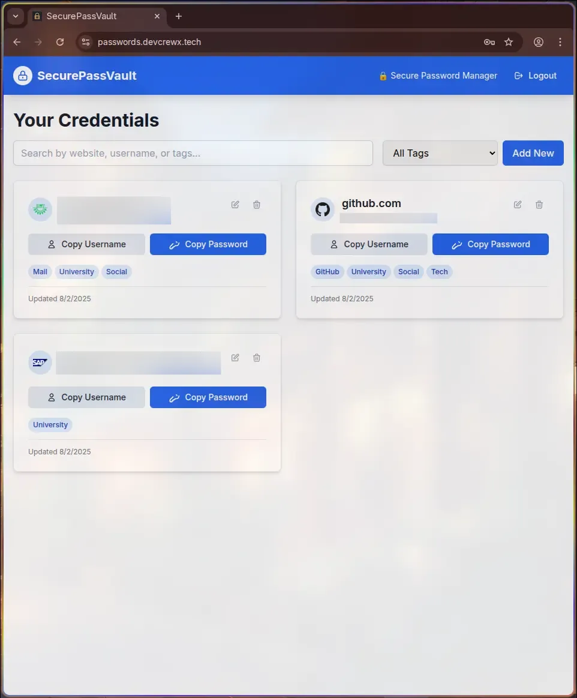

# SecurePassVault

[](https://opensource.org/licenses/MIT)  
A secure, full-fledged password manager web application with encryption, tagging, and master password-based authentication. Built with modern web technologies and deployed on Ubuntu server for complete control over your sensitive data.

## 🚀 Features

### 🔐 Core Features
- **Master Password Authentication**: Secure login system with bcrypt-hashed master passwords
- **Credential Management**: Add, view, edit, and delete website credentials
- **Advanced Search & Filtering**: Searchable dashboard with tag-based filtering
- **One-Click Copy**: Copy username and password buttons with clipboard integration
- **Tagging System**: Organize credentials with custom tags (e.g., social, college, banking)
- **Responsive Design**: Mobile-first responsive interface built with Tailwind CSS

### 🔒 Security Features
- **AES-256-GCM Encryption**: All passwords encrypted with industry-standard encryption
- **PBKDF2 Key Derivation**: Master password never stored, keys derived securely
- **JWT Authentication**: Secure session management with httpOnly cookies
- **HTTPS Communication**: End-to-end encrypted data transmission
- **Input Sanitization**: XSS and CSRF protection with comprehensive validation
- **Auto-Clear Clipboard**: Optional clipboard clearing after timeout for enhanced security

---

## 🖼️ Screenshots
### Login Page


### Dashboard


### Add Credential Modal


### Mobile View


---

## 🛠️ Technologies Used

| Layer | Technology |
|-------|------------|
| **Frontend** | React.js 18.2, Tailwind CSS 3.3, React Router DOM 6.15 |
| **Backend** | Node.js, Express.js 4.18, MongoDB with Mongoose 7.5 |
| **Authentication** | JWT 9.0, bcryptjs 2.4 |
| **Encryption** | Node.js crypto (AES-256-GCM), PBKDF2 |
| **Security** | Helmet, CORS, Express Rate Limit, Express Validator |
| **Deployment** | Ubuntu Server, Nginx, PM2, MongoDB (self-hosted) |

---

## 📂 Project Structure
```plaintext
securepassvault/
├── client/                    # React frontend application
│   ├── src/
│   │   ├── components/        # Reusable UI components
│   │   ├── pages/             # Page components (Login, Dashboard)
│   │   ├── hooks/             # Custom React hooks (useAuth, useClipboard)
│   │   ├── utils/             # Frontend utilities (crypto, helpers)
│   │   └── App.js             # Main React application
│   ├── public/                # Static files and assets
│   ├── build/                 # Production build files
│   └── package.json           # Client dependencies
├── server/                    # Express backend application
│   ├── routes/                # API route handlers
│   │   ├── auth.js            # Authentication routes
│   │   └── credentials.js     # Credential management routes
│   ├── models/                # MongoDB data models
│   │   ├── User.js            # User schema
│   │   └── Credential.js      # Credential schema
│   ├── middleware/            # Custom middleware
│   │   └── authMiddleware.js  # JWT authentication middleware
│   ├── utils/                 # Server utilities
│   │   └── cryptoUtils.js     # Encryption/decryption functions
│   ├── index.js               # Express server entry point
│   └── package.json           # Server dependencies
├── .env                       # Environment variables
├── .gitignore                 # Git ignore rules
├── LICENSE                    # MIT License
└── README.md                  # Project documentation
```

---

## ✨ How It Works

1. **Master Password Authentication**: Users create an account with a master password that's never stored on the server
2. **Key Derivation**: PBKDF2 derives encryption keys from the master password client-side
3. **Data Encryption**: All credential passwords are encrypted with AES-256-GCM before transmission
4. **Secure Storage**: Encrypted data and initialization vectors stored separately in MongoDB
5. **Client-Side Decryption**: Data is decrypted in the browser after authentication
6. **Tag Organization**: Users can organize credentials with custom tags for easy filtering
7. **Clipboard Integration**: Secure copy-to-clipboard functionality with optional auto-clear

---

## ⚙️ Installation & Deployment

### Prerequisites
- Node.js (v16 or higher)
- MongoDB (v5.0 or higher)
- Git

### Local Development Setup

1. **Clone the repository:**
   ```bash
   git clone https://github.com/ArindamTripathi619/securepassvault.git
   cd securepassvault
   ```

2. **Install server dependencies:**
   ```bash
   cd server
   npm install
   ```

3. **Install client dependencies:**
   ```bash
   cd ../client
   npm install
   ```

4. **Set up environment variables:**
   Create a `.env` file in the server directory:
   ```env
   PORT=4000
   JWT_SECRET=your_super_secret_jwt_key_here
   DB_URI=mongodb://localhost:27017/securepassvault
   NODE_ENV=development
   ```

5. **Start MongoDB:**
   ```bash
   # On Ubuntu/Debian
   sudo systemctl start mongod
   
   # On Arch Linux
   sudo systemctl start mongodb
   ```

6. **Run the development servers:**
   ```bash
   # Terminal 1 - Start backend server
   cd server
   npm run dev
   
   # Terminal 2 - Start frontend development server
   cd client
   npm start
   ```

7. **Access the application:**
   - Frontend: http://localhost:3000
   - Backend API: http://localhost:4000

### Production Deployment (Ubuntu Server)

1. **Server Setup:**
   ```bash
   sudo apt update && sudo apt upgrade -y
   sudo apt install nginx mongodb git curl nodejs npm -y
   sudo npm install -g pm2
   ```

2. **MongoDB Configuration:**
   ```bash
   sudo systemctl enable mongodb
   sudo systemctl start mongodb
   ```

3. **Deploy the Application:**
   ```bash
   cd /var/www
   sudo git clone https://github.com/ArindamTripathi619/securepassvault.git
   sudo chown -R $USER:$USER securepassvault
   cd securepassvault
   
   # Install and build
   cd server && npm install
   cd ../client && npm install && npm run build
   ```

4. **Configure Environment:**
   ```bash
   cd ../server
   cp .env.example .env
   # Edit .env with production values
   ```

5. **Start with PM2:**
   ```bash
   pm2 start index.js --name securepassvault-api
   pm2 save
   pm2 startup
   ```

6. **Configure Nginx:**
   Create `/etc/nginx/sites-available/securepassvault`:
   ```nginx
   server {
       listen 80;
       server_name passwords.devcrewx.tech;
       
       location /api/ {
           proxy_pass http://localhost:4000/;
           proxy_http_version 1.1;
           proxy_set_header Upgrade $http_upgrade;
           proxy_set_header Connection 'upgrade';
           proxy_set_header Host $host;
           proxy_set_header X-Real-IP $remote_addr;
           proxy_set_header X-Forwarded-For $proxy_add_x_forwarded_for;
           proxy_set_header X-Forwarded-Proto $scheme;
           proxy_cache_bypass $http_upgrade;
       }
       
       location / {
           root /var/www/securepassvault/client/build;
           index index.html index.htm;
           try_files $uri $uri/ /index.html;
       }
   }
   ```

7. **Enable Site and SSL:**
   ```bash
   sudo ln -s /etc/nginx/sites-available/securepassvault /etc/nginx/sites-enabled/
   sudo nginx -t
   sudo systemctl restart nginx
   
   # Setup SSL with Certbot
   sudo apt install certbot python3-certbot-nginx -y
   sudo certbot --nginx -d <your_domain_name>
   ```

8. **Configure Firewall:**
   ```bash
   sudo ufw allow OpenSSH
   sudo ufw allow 'Nginx Full'
   sudo ufw enable
   ```

---

## 📚 Environment Configuration

### Server Environment Variables (.env)
```env
# Server Configuration
PORT=4000
NODE_ENV=production

# Database
DB_URI=mongodb://localhost:27017/securepassvault

# Authentication
JWT_SECRET=your_super_secret_jwt_key_minimum_32_characters

# Security (Optional)
BCRYPT_ROUNDS=12
RATE_LIMIT_WINDOW_MS=900000
RATE_LIMIT_MAX_REQUESTS=100
```

### Security Best Practices
- Use a strong, unique JWT secret (minimum 32 characters)
- Enable MongoDB authentication in production
- Regular database backups
- Monitor application logs
- Keep dependencies updated

---

## 🔐 Security Architecture

### Encryption Flow
1. **Master Password** → PBKDF2 (100,000 iterations) → **Encryption Key**
2. **Credential Password** + **Random IV** → AES-256-GCM → **Encrypted Data**
3. **Encrypted Data** + **IV** → Stored separately in MongoDB

### Authentication Flow
1. User provides master password
2. Server verifies bcrypt hash
3. JWT token issued with httpOnly cookie
4. Client-side key derivation for decryption
5. All API requests authenticated via JWT middleware

---

## 📚 API Documentation

### Authentication Endpoints
- `POST /api/auth/register` - Create new user account
- `POST /api/auth/login` - Authenticate user
- `POST /api/auth/logout` - Invalidate session
- `GET /api/auth/verify` - Verify JWT token

### Credential Endpoints
- `GET /api/credentials` - Get all user credentials
- `POST /api/credentials` - Create new credential
- `PUT /api/credentials/:id` - Update existing credential
- `DELETE /api/credentials/:id` - Delete credential

---

## 🧪 Testing

### Run Tests
```bash
# Backend tests
cd server
npm test

# Frontend tests
cd client
npm test
```

### Manual Testing Checklist
- [ ] User registration and login
- [ ] Add, edit, delete credentials
- [ ] Search and filter functionality
- [ ] Clipboard copy operations
- [ ] Mobile responsiveness
- [ ] Security: XSS, CSRF protection

---

## 🔧 Backup & Maintenance

### Database Backup
```bash
# Create backup directory
sudo mkdir -p /var/backups/securepassvault

# Add to crontab for daily backups at 2 AM
0 2 * * * mongodump --out /var/backups/securepassvault/$(date +\%F)

# Restore from backup
mongorestore /var/backups/securepassvault/2025-01-01/securepassvault
```

### Log Monitoring
```bash
# PM2 logs
pm2 logs securepassvault-api

# Nginx logs
sudo tail -f /var/log/nginx/access.log
sudo tail -f /var/log/nginx/error.log
```

---

## 🧑‍💻 Contributing

Contributions are welcome! Please follow these steps:

1. Fork the repository
2. Create a feature branch (`git checkout -b feature/AmazingFeature`)
3. Commit your changes (`git commit -m 'Add some AmazingFeature'`)
4. Push to the branch (`git push origin feature/AmazingFeature`)
5. Open a Pull Request

### Development Guidelines
- Follow existing code style and conventions
- Add tests for new features
- Update documentation as needed
- Ensure security best practices

---

## 📝 License

This project is licensed under the MIT License - see the [LICENSE](LICENSE) file for details.

---

## 📧 Contact

Created by [Arindam Tripathi](https://github.com/ArindamTripathi619)  
For any inquiries or suggestions, feel free to reach out!

**Live Demo**: [https://passwords.devcrewx.tech](https://passwords.devcrewx.tech)

### Social Links  
[](https://www.instagram.com/_arindxm/)  [](https://www.facebook.com/arindam.tripathi.180/)  [](https://www.linkedin.com/in/arindam-tripathi-962551349/)  [](https://www.youtube.com/@arindamtripathi4602)  

---

## 🙏 Acknowledgments

- [React.js](https://reactjs.org/) - Frontend framework
- [Express.js](https://expressjs.com/) - Backend framework
- [MongoDB](https://www.mongodb.com/) - Database
- [Tailwind CSS](https://tailwindcss.com/) - CSS framework
- [Node.js Crypto](https://nodejs.org/api/crypto.html) - Encryption library

---
